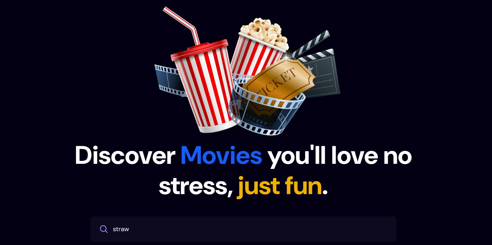
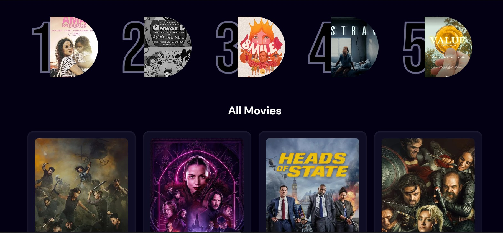
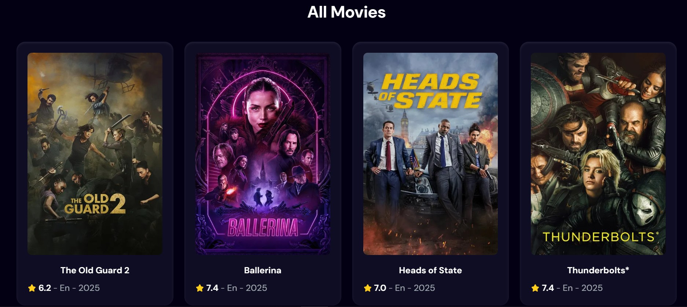
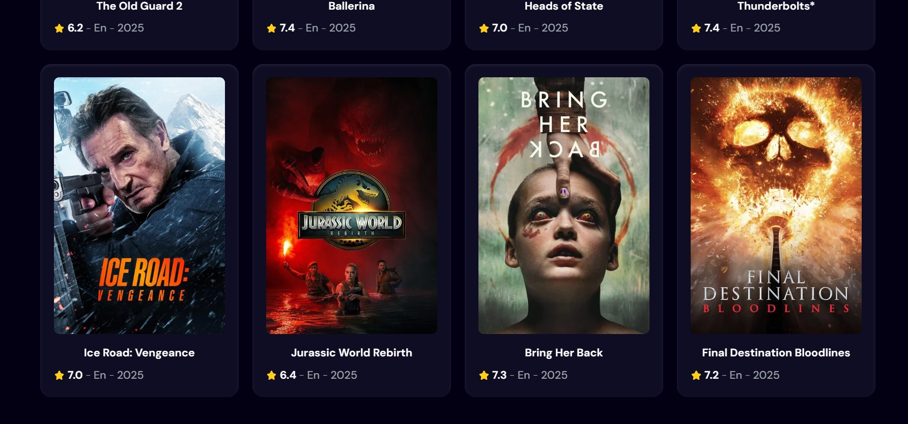
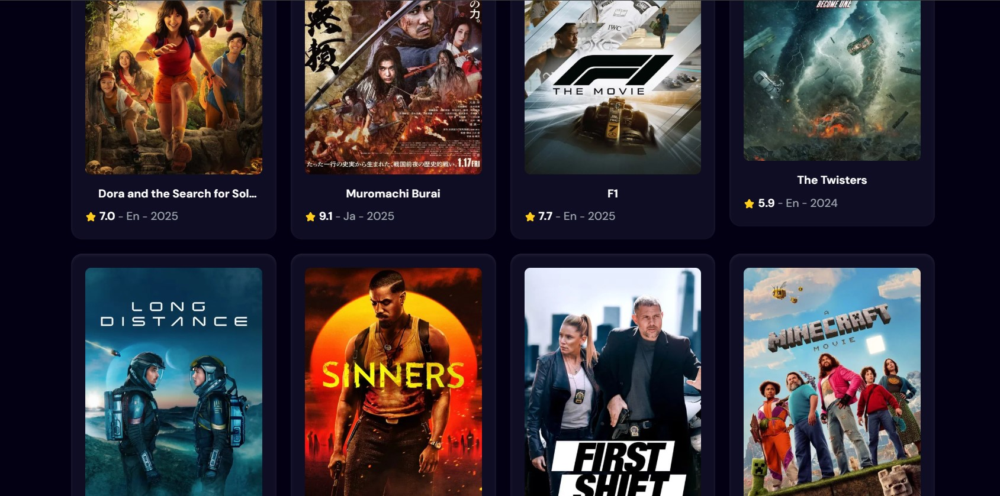

# 🎬 MovieScope

**MovieScope** is a modern and responsive web application that allows users to browse, search, and discover movies from a wide selection of genres. Built with **React**, **Tailwind CSS**, and **React Router**, it provides a clean and interactive user experience.

## 🚀 Features

- 🔍 **Search movies** by title
- 🎞️ Browse trending and popular movies
- 🧾 View detailed movie info: title, rating, description, poster, and more
- 🌐 Fully **responsive design** (desktop, tablet, mobile)
- ⚡ Built with **React**, **Tailwind CSS**

## 🌐 Live Demo

[👉 View Live](https://moviescopapp.netlify.app/)  

## 🛠️ Tech Stack

- **React** – UI components
- **Tailwind CSS** – Utility-first styling
- **Movie API** – ([TMDB](https://www.themoviedb.org/))

## 📷 Screenshots

